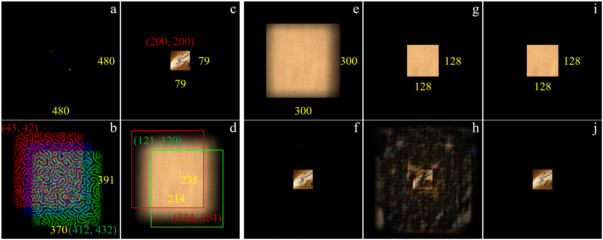
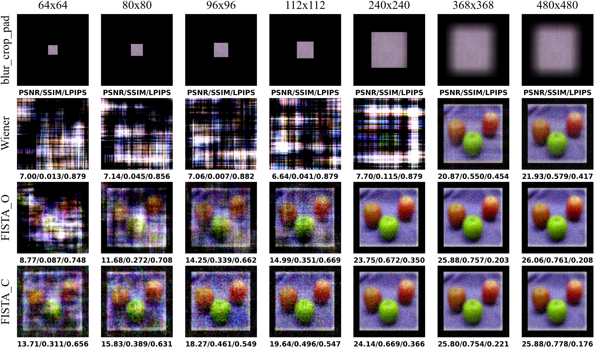
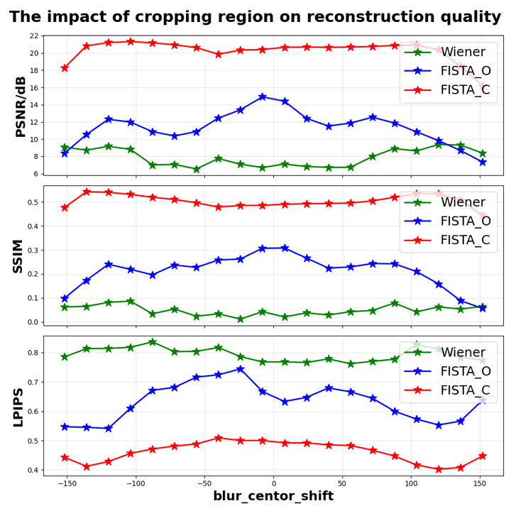

<<<<<<< HEAD
# FISTA_C: High-quality Reconstruction for Miniaturized Lensless Cameras

PyTorch implementation for the paper **"High-quality reconstruction method for miniaturized lensless cameras based on imaging model optimization"** (Optics Express, 2026).

> **Paper**: [https://opg.optica.org/oe/abstract.cfm?URI=oe-34-15-26909](https://opg.optica.org/oe/abstract.cfm?URI=oe-34-15-26909)
> **DOI**: [10.1364/OE.595581](https://doi.org/10.1364/OE.595581)
> **Project page**: [https://github.com/fylr/FISTA_C](https://github.com/fylr/FISTA_C)

---

## About

### Highlights

- **Optimized imaging model**: By applying a cropping operator to the scene image, the reconstruction equations are transformed from underdetermined to overdetermined, enabling stable high-quality reconstruction from small-sized blur images.
- **FISTA_C**: An improved FISTA algorithm with TV regularization on the optimized imaging model, achieving better reconstruction quality and stability than traditional methods under small blur input.
- **FISTA_C+U**: Combining FISTA_C with a U-Net perceptual enhancement network, achieving state-of-the-art results on both captured and public datasets.
- **Comprehensive baselines**: Includes implementations of Wiener, FISTA_O, U-Net, FlatNet-gen-C, and MWDN-CPSF for fair comparison.

### Method Overview

The multiplexing property of lensless imaging makes the encoded blur image significantly larger than the effective scene region. Existing methods use the padded scene `view_pad` as the unknown, leading to severely underdetermined equations when the blur is cropped to a small size. We optimize the imaging model by cropping the scene to its effective region `view`:

```
Original model:   b_crop = C1 M v_pad + n       (underdetermined for small blur)
Optimized model:  b_crop = C1 M C2^H v + n       (overdetermined when blur_size > view_size)
```



*Fig. 1: Imaging principle of the lensless camera and constraints of cropped blur on reconstruction performance. (a-b) Optical encoding process; (c-d) typical scene and its complete encoded blur; (e-h) reconstruction degradation with smaller blur crops using conventional FISTA; (i-j) our FISTA_C method recovers high-quality results even from a 128x128 blur crop.*

### Algorithms

| Category | Method | Description | Equation |
|----------|--------|-------------|----------|
| Traditional | **Wiener** | Analytical solution of the optimized model | Eq. (4) |
| Traditional | **FISTA_O** | FISTA on original model + sparse regularization | Eq. (5) |
| Traditional | **FISTA_C** (proposed) | FISTA on optimized model + TV regularization | Eq. (6) |
| Deep Learning | **U-Net** | Pure end-to-end deep learning baseline | Sec. 2.3 |
| Deep Learning | **FlatNet-gen-C** | Wiener inversion + U-Net refinement | Sec. 3.2 |
| Deep Learning | **MWDN-CPSF** | Multi-scale Wiener deconvolution + U-Net | Sec. 3.2 |
| Deep Learning | **FISTA_C+U** (proposed) | FISTA_C preliminary + U-Net enhancement | Sec. 2.3 |

---

## Project Structure

```
FISTA_C/
├── algorithms/
│   ├── __init__.py
│   ├── fourier.py              # Centered FFT helpers, pad/crop operators
│   └── reconstruction.py       # Wiener, FISTA_O, FISTA_C (LenslessReconstructor)
├── net/
│   ├── __init__.py
│   ├── unet.py                 # U-Net architecture (Table 1)
│   ├── flatnet.py              # FlatNet-gen-C (Wiener + U-Net)
│   ├── mswn_unet.py            # MWDN-CPSF (multi-scale Wiener + U-Net)
│   └── fista_c_u.py            # FISTA_C+U (proposed pipeline)
├── dataset/
│   ├── __init__.py
│   ├── base.py                 # Base paired-image dataset class
│   ├── ocifar100.py            # OCIFAR100 (captured, shared gt/blur/blur_sim)
│   ├── ocifar100_sim.py        # OCIFAR100_sim (wrapper over OCIFAR100 blur_sim)
│   └── ophlatcam.py            # PhlatCam (public, gt/blur, 99:1 split)
├── utils/
│   ├── __init__.py
│   ├── image_loader.py         # Image loading (OpenCV, PIL)
│   └── metrics.py              # PSNR, SSIM, LPIPS
├── configs/
│   └── default.yaml            # Default configuration
├── samples/
│   ├── psf/                    # PSF images (PhlatCam_psf.png, etc.)
│   ├── OCIFAR100/              # Sample OCIFAR100 pairs (shared gt/blur/blur_sim)
│   └── OPhlatCam/              # Sample PhlatCam pairs (blur/gt)
├── checkpoints/                # Pretrained model weights
├── imgs/                       # Paper figures for README
├── demo_traditional.py         # Demo: Wiener / FISTA_O / FISTA_C
├── demo_deep_learning.py       # Demo: U-Net / FlatNet / MWDN / FISTA_C+U
├── evaluate.py                 # Evaluate on dataset test sets
├── requirements.txt
├── environment.yml
├── citation.bib                # BibTeX entry for our paper
├── .gitignore
├── LICENSE
└── README.md
```

---

## Setup

### 1. Clone the repository

```bash
git clone https://github.com/fylr/FISTA_C.git
cd FISTA_C
```

### 2. Install dependencies

```bash
# Using pip
pip install -r requirements.txt

# Or using conda
conda env create -f environment.yml
conda activate fista_c
```

### 3. Prepare data

The repository includes small sample datasets under `samples/` for quick testing:

- `samples/OCIFAR100/` — sample OCIFAR100 pairs (shared `gt/` + `blur/` for OCIFAR100 + `blur_sim/` for OCIFAR100_sim, 2 test images)
- `samples/OPhlatCam/` — sample PhlatCam pairs (blur / gt, 2 test images)
- `samples/psf/` — PSF images: `PhlatCam_psf.png` (OCIFAR100), `PhlatCam_psf_sim.png` (OCIFAR100_sim), `OPhlatCam_psf.png` (PhlatCam)

> **Note**: OCIFAR100 uses `samples/psf/PhlatCam_psf.png` and OCIFAR100_sim uses `samples/psf/PhlatCam_psf_sim.png`; both are included in the repository. The full datasets (50k/10k train/test images) and pretrained weights are provided via the links below.

Full datasets and pretrained model weights are provided via Baidu Pan:

- **Datasets** (OCIFAR100 / OCIFAR100_sim / PhlatCam):
  https://pan.baidu.com/s/1cwhhNUR0Fp2TRUaFFa7c6w?pwd=i52g
- **Pretrained models** (checkpoints):
  https://pan.baidu.com/s/1-7SeB1KHKXBkn14w1mxypA?pwd=vgap

After downloading:

**Datasets** — the downloaded folder contains per-dataset archives that may be split into multi-volume `.part-*` files (as shown below). Merge the parts, verify the MD5 checksums, and extract before use.

Example for `OPhlatCam` (do the same for `OCIFAR100` / `OCIFAR100_sim`):

```bash
# 1. Merge split blur archives into one tar.gz
cd OPhlatCam/blur
cat blur.tgz.part-aa blur.tgz.part-ab blur.tgz.part-ac blur.tgz.part-ad > blur.tgz

# 2. Verify integrity (Linux/macOS; optional but recommended)
md5sum -c blur.md5

# 3. Extract
tar -xzf blur.tgz

cd ../gt
md5sum -c gt.md5
tar -xzf gt.tgz
```

On **Windows** you can merge parts with:

```cmd
cd OPhlatCam\blur
copy /b blur.tgz.part-aa + blur.tgz.part-ab + blur.tgz.part-ac + blur.tgz.part-ad blur.tgz
tar -xzf blur.tgz
```

After extraction the directory layout should match the "Datasets" section below, e.g.:

```
OPhlatCam/
├── blur/
│   └── ...           # 10,000 blurred images
└── gt/
    └── ...           # 10,000 ground-truth images
```

**Pretrained models** — place under `checkpoints/`:

```bash
unzip models.zip -d checkpoints/
```

The BibTeX citation file is also included: [`oe-34-15-26909.bib`](oe-34-15-26909.bib).

---

## Datasets

Three datasets are supported, all organized in ImageFolder-style directory layout.

### OCIFAR100 (captured)

```
ocifar100/
├── gt/            # ground-truth scenes
│   ├── train/     # 50,000 images in 100 class folders
│   └── test/      # 10,000 images in 100 class folders
├── blur/          # real captured blur images
│   ├── train/
│   └── test/
└── blur_sim/      # simulated blur (PSF convolution + noise)
    ├── train/
    └── test/
```

```python
from dataset import OCIFAR100

# Load real captured blur
test_set = OCIFAR100("/path/to/ocifar100", split="test", blur_type="blur",
                     blur_size=(112, 112), obj_size=(96, 96))

# Load simulated blur
test_set_sim = OCIFAR100("/path/to/ocifar100", split="test", blur_type="blur_sim",
                         blur_size=(112, 112), obj_size=(96, 96))
```

### OCIFAR100_sim (simulated blur)

OCIFAR100_sim **shares the same ground-truth (`gt/`) and the same root
directory** as OCIFAR100. It only differs in the blur source: it loads the
simulated blur (`blur_sim/`) while OCIFAR100 loads the captured blur (`blur/`).
The corresponding PSF is `PhlatCam_psf_sim.png`.

```
ocifar100/                       # common root shared with OCIFAR100
├── gt/          (shared)        # ground-truth scenes
│   ├── train/                     # 50,000 images in 100 class folders
│   └── test/                      # 10,000 images in 100 class folders
├── blur/        (OCIFAR100)     # real captured blur
│   ├── train/
│   └── test/
└── blur_sim/    (OCIFAR100_sim) # simulated blur (PSF convolution + Poisson/Gaussian noise)
    ├── train/
    └── test/
```

```python
from dataset import OCIFAR100Sim

# Reads gt/ and blur_sim/ from the SAME ocifar100/ root (not a separate folder)
test_set = OCIFAR100Sim("/path/to/ocifar100", split="test",
                        blur_size=(112, 112), obj_size=(96, 96))
```

### PhlatCam (public)

```
ophlatcam/
├── gt/            # 10,000 images in 1,000 class folders
└── blur/          # 10,000 images in 1,000 class folders
```

No predefined train/test split; the 10k pairs are split 99:1 programmatically (as in the original paper).

```python
from dataset import OPhlatCam, get_ophlatcam_loaders

train_loader, test_loader = get_ophlatcam_loaders(
    "/path/to/ophlatcam", blur_size=(224, 224), obj_size=(192, 192),
    batch_size=8, train_ratio=0.99,
)
```

---

## Usage

### Traditional Model-Based Reconstruction

```bash
# Using the included PhlatCam sample data
python demo_traditional.py \
    --psf samples/psf/PhlatCam_psf.png \
    --blur samples/OPhlatCam/blur/n01440764/n01440764_1154.png \
    --gt samples/OPhlatCam/gt/n01440764/n01440764_1154.png \
    --obj_size 192 192 --blur_size 224 224 --conv_size 640 704

# Using OCIFAR100 sample (PhlatCam PSF)
python demo_traditional.py \
    --psf samples/psf/PhlatCam_psf.png \
    --blur samples/OCIFAR100/blur/test/apple/00-000.png \
    --gt samples/OCIFAR100/gt/test/apple/00-000.png \
    --obj_size 96 96 --blur_size 112 112 --conv_size 480 480

# Using OCIFAR100_sim sample (PhlatCam simulated PSF)
python demo_traditional.py \
    --psf samples/psf/PhlatCam_psf_sim.png \
    --blur samples/OCIFAR100/blur_sim/test/apple/00-000.png \
    --gt samples/OCIFAR100/gt/test/apple/00-000.png \
    --obj_size 96 96 --blur_size 112 112 --conv_size 480 480

# Without blur image (generates synthetic measurement from GT)
python demo_traditional.py \
    --psf samples/psf/PhlatCam_psf.png \
    --gt samples/OPhlatCam/gt/n01440764/n01440764_1154.png \
    --obj_size 192 192 --blur_size 224 224 --conv_size 640 704
```

This runs Wiener, FISTA_O, and FISTA_C sequentially and outputs a comparison figure with PSNR/SSIM metrics.

### Deep Learning Reconstruction

```bash
# Using the included PhlatCam sample data
python demo_deep_learning.py \
    --psf samples/psf/PhlatCam_psf.png \
    --blur samples/OPhlatCam/blur/n01440764/n01440764_1154.png \
    --gt samples/OPhlatCam/gt/n01440764/n01440764_1154.png \
    --obj_size 192 192 --blur_size 224 224 --conv_size 640 704 \
    --methods unet flatnet mswn fista_c_u

# Run only the proposed FISTA_C+U with pretrained weights
python demo_deep_learning.py \
    --psf samples/psf/PhlatCam_psf.png \
    --blur samples/OPhlatCam/blur/n01440764/n01440764_1154.png \
    --obj_size 192 192 --blur_size 224 224 --conv_size 640 704 \
    --methods fista_c_u \
    --checkpoints fista_c_u=checkpoints/fista_c_u_ophlatcam.pth
```

### Python API

```python
import torch
from algorithms.reconstruction import LenslessReconstructor

# Initialize reconstructor
recon = LenslessReconstructor(
    psf_path="samples/psf/PhlatCam_psf.png",
    obj_size=(96, 96), blur_size=(112, 112), conv_size=(480, 480),
)

# Set measurement and reconstruct
recon.set_measurement(blur_tensor)  # blur_tensor: (B, C, H, W) in [0,1]
rec_wiener, _ = recon.wiener()
rec_fista_o, _ = recon.fista_o(lamda=1e-2, iters=1500)
rec_fista_c, _ = recon.fista_c(lamda=1e-4, iters=1500)
```

```python
from net.fista_c_u import FISTA_C_U

# Proposed FISTA_C+U pipeline
model = FISTA_C_U(
    psf_path="samples/psf/PhlatCam_psf.png",
    obj_size=(96, 96), blur_size=(112, 112), conv_size=(480, 480),
)
# Available pretrained weights (see the models link in Prepare data):
#   checkpoints/fista_c_u_ophlatcam.pth
#   checkpoints/fista_c_u_ocifar100.pth
#   checkpoints/fista_c_u_ocifar100_sim.pth
model.load_state_dict(torch.load("checkpoints/fista_c_u_ocifar100.pth")["model"])
model.eval()

with torch.no_grad():
    rec = model(blur_tensor)  # FISTA_C -> U-Net
```

### Evaluation on Dataset Test Sets

```bash
# Traditional FISTA_C on OCIFAR100 sample test set (PhlatCam PSF)
python evaluate.py --dataset ocifar100 --ds_path samples/OCIFAR100 \
    --psf samples/psf/PhlatCam_psf.png --method fista_c --lamda 1e-4 --iters 1500

# Traditional FISTA_C on OCIFAR100_sim sample test set (PhlatCam simulated PSF)
python evaluate.py --dataset ocifar100_sim --ds_path samples/OCIFAR100 \
    --psf samples/psf/PhlatCam_psf_sim.png --method fista_c --lamda 1e-4 --iters 1500

# Deep learning FISTA_C+U on PhlatCam sample test set
python evaluate.py --dataset ophlatcam --ds_path samples/OPhlatCam \
    --psf samples/psf/PhlatCam_psf.png --method fista_c_u \
    --checkpoint checkpoints/fista_c_u_ophlatcam.pth \
    --blur_size 224 224 --obj_size 192 192 --conv_size 640 704 \
    --use_lpips
```

Supported `--method` values: `wiener`, `fista_o`, `fista_c`, `unet`, `flatnet`, `mswn`, `fista_c_u`.

---

## Key Results

### OCIFAR100 (captured dataset, blur_size=112x112)

| Method | PSNR (dB) | SSIM | LPIPS |
|--------|-----------|------|-------|
| U-Net | 28.87 | 0.887 | 0.066 |
| FlatNet-gen-C | 33.60 | 0.956 | 0.018 |
| MWDN-CPSF | 35.17 | 0.967 | 0.013 |
| **FISTA_C+U** | **35.97** | **0.971** | **0.013** |

### PhlatCam (public dataset, blur_size=224x224)

| Method | PSNR (dB) | SSIM | LPIPS |
|--------|-----------|------|-------|
| FISTA_O | 9.37 | 0.102 | 0.980 |
| FISTA_C | 10.09 | 0.248 | 0.736 |
| U-Net | 16.13 | 0.354 | 0.463 |
| FlatNet-gen-C | 20.57 | 0.570 | 0.320 |
| MWDN-CPSF | 20.82 | 0.576 | 0.332 |
| **FISTA_C+U** | **21.83** | **0.606** | **0.249** |

### Impact of blur cropping size (OCIFAR100_sim)



*Fig. 4: Visual comparison of reconstruction results of Wiener, FISTA_O, and FISTA_C under typical cropping sizes (64x64, 80x80, 96x96, 112x112, 240x240, 368x368, 480x480) on OCIFAR100_sim. FISTA_C can reconstruct basic visual content even with very small cropping sizes, and blur_size=112x112 is the minimum size ensuring high-quality reconstruction.*

### Impact of blur cropping region (OCIFAR100_sim)



*Fig. 5: Impact of blur cropping region on reconstruction performance on OCIFAR100_sim. blur_crop of size 112x112 is cropped from different regions along the main diagonal. FISTA_C is less sensitive to the cropping region and can stably reconstruct scene information as long as blur_crop contains sufficient information.*

---

## Citation

If you use this code for your research, please cite our paper:

```bibtex
@article{Chen:26,
  author    = {Kaiyu Chen and Ying Li and Zhengdai Li and Jiangtao Hu and Qizhen Zhao and Youming Guo},
  title     = {High-quality reconstruction method for miniaturized lensless cameras based on imaging model optimization},
  journal   = {Opt. Express},
  volume    = {34},
  number    = {15},
  pages     = {26909--26925},
  month     = {Jul},
  year      = {2026},
  publisher = {Optica Publishing Group},
  doi       = {10.1364/OE.595581},
  url       = {https://opg.optica.org/oe/abstract.cfm?URI=oe-34-15-26909},
}
```

---

## Acknowledgments

This work was supported by the National Natural Science Foundation of China (12433010, 12527802).

## License

This project is released under the [MIT License](LICENSE).
